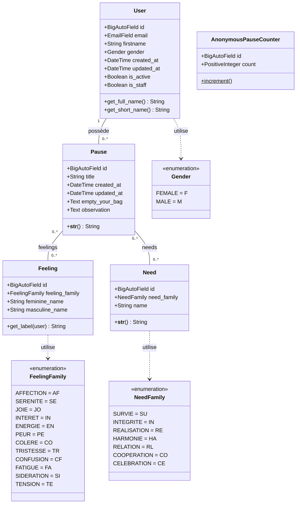

# Diagramme de classes UML — Pause Empathique

État du code local au 11 septembre 2026. Ce diagramme représente les cinq
modèles métier persistés par Django, avec leurs attributs et leurs principales
méthodes. Les vues, serializers, stores Pinia et interfaces TypeScript ne font
pas partie de cette vue du domaine.

## Lecture et contraintes

- Une pause enregistrée appartient à exactement un utilisateur ; un utilisateur
  peut posséder zéro à plusieurs pauses. `Pause.user` est une clé étrangère avec
  `on_delete=CASCADE` : supprimer le compte supprime ses pauses.
- Les sentiments et besoins sont des catalogues partagés. Chaque relation avec
  `Pause` est un `ManyToManyField`, dont Django crée la table d'association.
  Ces tables techniques sont omises du diagramme de classes.
- Les cardinalités `0..*` décrivent les associations possibles en persistance.
  À la création via l'API, `PauseSerializer` exige au moins un sentiment et un
  besoin (`allow_empty=False`). Lors d'un PATCH, ces champs peuvent être omis,
  mais une liste vide est refusée lorsqu'ils sont fournis.
- `AnonymousPauseCounter` est indépendant : terminer une pratique anonyme via
  l'API incrémente le compteur sans créer de `Pause` ni conserver son contenu.
  `increment()` est une méthode de classe (opération soulignée dans le rendu).
  Elle utilise la ligne `pk=1` par convention ; le modèle n'interdit pas d'autres
  lignes. Aucun timestamp n'existe encore sur ce modèle.
- Les types `Gender`, `FeelingFamily` et `NeedFamily` représentent les
  énumérations `TextChoices` imbriquées dans leurs modèles respectifs ; leurs
  codes sont stockés dans des champs texte, sans table de famille distincte.

| Classe | Contraintes et valeurs par défaut |
| --- | --- |
| `User` | Email unique ; prénom de 150 caractères maximum ; genre sur 1 caractère ; `is_active=True`, `is_staff=False`. |
| `Pause` | Titre de 200 caractères maximum, généré par `default_pause_title()` s'il est absent ; `empty_your_bag` et `observation` acceptent une chaîne vide et valent `""` par défaut. |
| `Feeling` | Noms féminin et masculin de 100 caractères maximum ; code famille de 4 caractères maximum. |
| `Need` | Nom de 100 caractères maximum ; code famille de 4 caractères maximum. |
| `AnonymousPauseCounter` | Compteur entier supérieur ou égal à zéro, initialisé à `0`. |

Les identifiants `id` sont ajoutés implicitement par Django (`BigAutoField`).
Pour `User` et `Pause`, `updated_at` est actualisé à la sauvegarde ; `created_at`
utilise respectivement `default=timezone.now` et `auto_now_add=True`.

`User` hérite de `AbstractBaseUser` et `PermissionsMixin`. Leurs attributs
techniques (mot de passe haché, dernière connexion, superutilisateur, groupes et
permissions), les opérations ORM héritées et le gestionnaire `UserManager` sont
omis pour garder le diagramme centré sur le domaine.

`Feeling.get_label(user)` reste utilisé par les vues Django historiques. L'API
expose les deux libellés dans `names.f` et `names.m` ; la SPA choisit le libellé
avec `useGender()`. Ses interfaces décrivent le contrat HTTP et ne sont pas de
nouvelles entités persistées.

## Sources du projet

- [Modèle User](../users/models.py)
- [Modèles Pause, Feeling, Need et AnonymousPauseCounter](../pauses/models.py)
- [Validation et représentation API](../pauses/api/serializers.py)
- [Propriété des pauses et comptage anonyme dans l'API](../pauses/api/views.py)
- [Configuration du modèle utilisateur et des identifiants](../pause_empathique/settings.py)

Le bloc Mermaid est modifiable dans ce fichier et s'affiche dans un lecteur
Markdown prenant en charge Mermaid.
